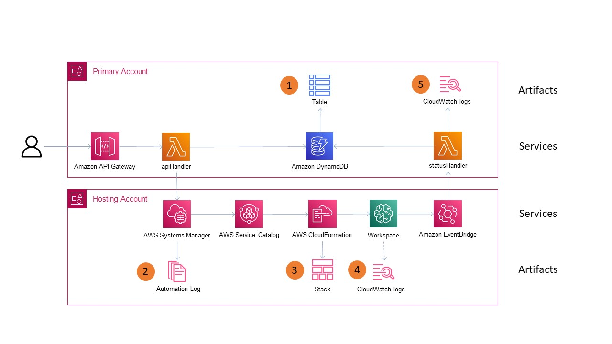
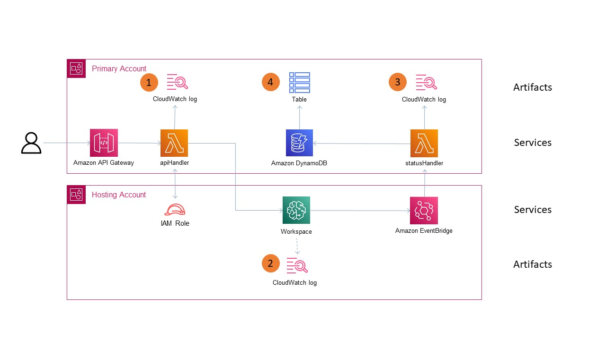

# Workspace Lifecycle Troubleshooting Guide

## Launching/Terminating a Workspace

A user will initiate the request through the UI, which in turn makes an API request.  The API Gateway calls the "apiHandler" Lambda function.  Each execution will execute a Systems Manager Automation within the hosting account.  It will also make a new entry in the DynamoDB table named `swb-<stage>-<awsRegionShortName>` For example, the table might be named `swb-dev-va`.  (See item 1 in the diagram.)

In the hosting account, there will be an Execution ID entry in Systems Manager under Automation.  (See item 2 in diagram.)  The document will end in "Launch" or "Terminate" depending on the action requested.  The contents of this log detail which steps were executed successfuly and which, if any, failed.

One of the steps in the Systems Manager Execution creates or deletes a CloudFormation stack in the hosting account, depending on the request.  The stack will be named `SC-<AWS Account>-pp-<hash>`.  (See item 3 in the diagram.)  If successful, the Outputs tab will show values such as the resource ARN, instance names, etc.  If the stack fails to deploy or delete, look for details under the "Events" tab.

Some workspace types will create log files within CloudWatch under the hosting account.  (See item 4 in diagram.)  For example, if your workspace type is SageMaker, you can find a log group named `/aws/sagemaker/NotebookInstances` that contain detailed information about the workspace.  The information contained in these logs will vary by workspace.

As the workspace transitions, it sends events to EventBridge.  The Hosting account EventBridge sends these events to the Main account, where an EventBridge rule calls the "statusHandler" Lambda function in the Main account.  This Lambda creates a CloudWatch log in the group name that begins with `/aws/lambda/swb-<stage>-<awsRegionShortName>-statusHandlerLambda`.  For example, the log group may be named `/aws/lambda/swb-dev-va-statusHandlerLambda`.  (See item 5 in the diagram.)  The log entries will depend on the type of workspace being created.  For example, there will be two types of log entries for a SageMaker workspace.  There will be INFO records showing a status of `CREATE_IN_PROGRESS` and finally `InService` once provisioning is complete.  Any errors will also be shown in this log.

The "statusHandler" Lambda function is also responsible for updating the DynamoDB table entries for the workspace.  (See item 1 in the diagram.)  The DynamoDB values are reflected in the UI as the workspace's status for the user to see.

## Starting/Stopping a Workspace ##

A user will initiate the request through the UI, which will make an API request.  In turn, the Lambda function "apiLambda" will be called.  Each execution will generate a CloudWatch log in the group name that begins with `/aws/lambda/swb-<stage>-<awsRegionShortName>-apiLambda`.  For example, the log group may be named `/aws/lambda/swb-dev-va-apiHandler`.  (See item 1 in the diagram.)  If there are any errors when the Lambda function assumes the role in the Hosting account, they will be logged here.

The "apiLambda" function will then start or stop the workspace directly.  Some workspace types have log files within CloudWatch under the hosting account.  (See item 2 in diagram.)  For example, if your workspace type is SageMaker, you can find a log group named `/aws/sagemaker/NotebookInstances` that contain detailed information about the workspace.  The information contained in these logs will vary by workspace.

As the workspace transitions, it will send events to EventBridge.  The Hosting account EventBridge sends these events to the Main account, where an EventBridge rule calls the "statusHandler" Lambda function.  This Lambda creates a CloudWatch log in the group name that begins with `/aws/lambda/swb-<stage>-<awsRegionShortName>-statusHandlerLambda`.  For example, the log group may be named `/aws/lambda/swb-dev-va-statusHandlerLambda`.  (See item 3 in the diagram.)  The log entries will depend on the type of workspace being modified.  For example, there will be two log entries for a SageMaker workspace.  The INFO for the first will show a status of `Pending` for starts and "Stopping" for stops.  The second INFO entry will show a status of "InService" or `Stopped`.

The "statusHandler" Lambda function is also responsible for updating the DynamoDB table entries for the workspace.  It will update the items in the DynamoDB table named `swb-<stage>-<awsRegionShortName>` For example, the table might be named `swb-dev-va`.  (See item 4 in the diagram.)  The DynamoDB values are reflected in the UI as the workspace's status for the user to see.
